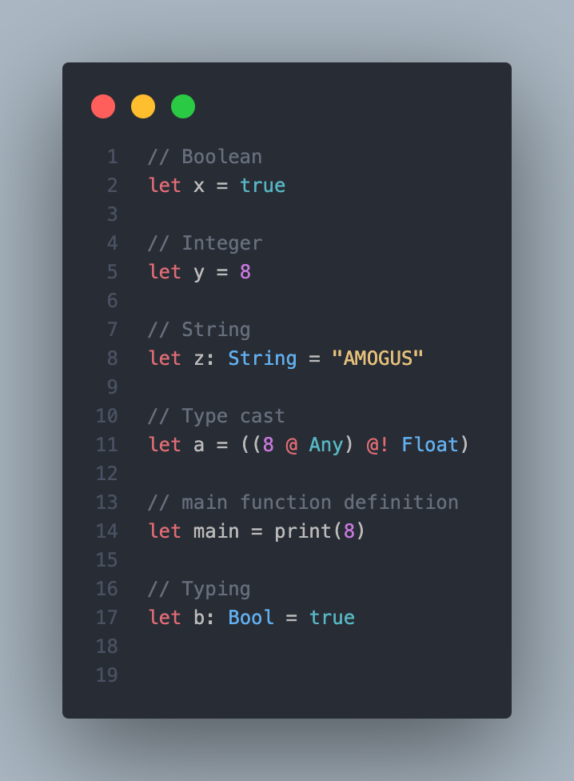

# Alpine VSCode Extension

An extension for Alpine language support.
Alpine is the language used by the CS-320 course at EPFL to study compilers.

## Features

- Code coloring
- Basic syntax completion
- Syntax and type error checking
- And more !

## Prerequisites

- Java Runtime Environment (JRE): Ensure that you have a working JRE installed on your system to run the application. You can download the latest version from the Oracle website.

## Usage

1. Install the extension from the VSCode Marketplace.
2. Open an Alpine project.
3. Start coding!

## Screenshots

## Contributing

If you would like to contribute, please fork the repository and submit a pull request.
